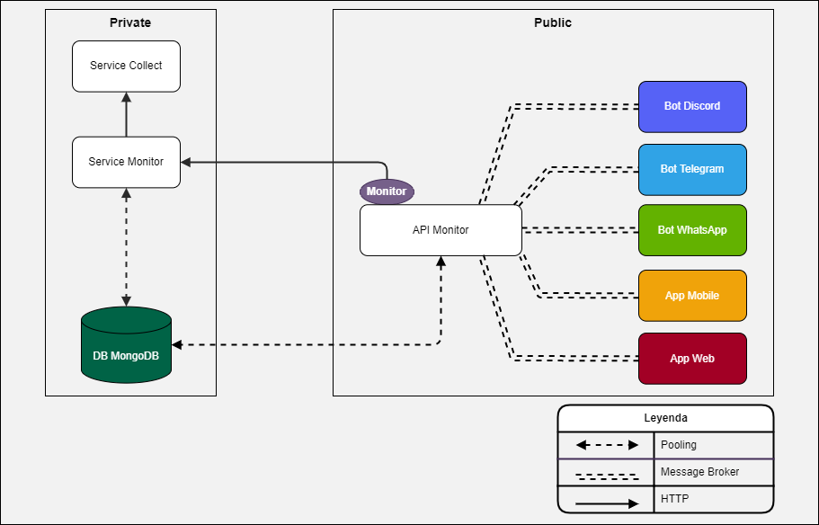

# Monitor Vzla

Monorepo con clientes para monitorear el precio del dolar paralelo en Venezuela obteniendo los datos desde diferentes
fuentes.

## Fuentes

- [x] Dolar Today: [dolartoday.com](https://www.dolartoday.com)

- [x] Airtm: [rates.airtm.io](https://rates.airtm.io)

- [x] Bcv: [bcv.org.ve](https://www.bcv.org.ve)

- [x] Local Bitcoins: [localbitcoins.com](https://www.localbitcoins.com)

- [x] En Paralelo Vzla: [@enparaleloenvzla](https://www.instagram.com/enparalelovzla3)

- [ ] Binance USDT: [binance.com](https://www.binance.com/es)

- [ ] Otras fuentes...

## Clientes

- [x] Bot de Discord [&#x279c; Readme](./packages/bot-discord)
- [x] Bot de Telegram [&#x279c; Readme](./packages/bot-telegram)
- [ ] Bot de Whatsapp
- [ ] App Mobile
- [ ] App Web

## Tecnologías

Los clientes hacen uso de los siguientes frameworks y librerías:

- Node.js
- TypeScript
- Socket.io
- Concord [&#x279c; NPM](https://npmjs.com/package/@edixon/concord)
- Telegraf [&#x279c; WEB](https://telegraf.js.org/)

## Estructura del Proyecto

